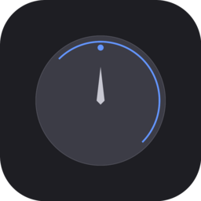

<p align="center">
  
</p>

<h1 align="center">Apollo Monitor</h1>

<p align="center">
  <strong>Control your Universal Audio Apollo from anywhere on your network.</strong>
</p>

<p align="center">
  <a href="https://github.com/noiseheroes/ApolloMonitor/releases"></a>
  
  
  <a href="LICENSE"></a>
</p>

---

## Overview

Apollo Monitor is a native macOS menu bar app for controlling Universal Audio Apollo monitor output. Works locally or remotely over your network — control volume, mute, dim, and mono from any Mac on your LAN.

No need to keep UA Console open on your screen. Just click the menu bar icon.

## Features

| Feature | Description |
|---------|-------------|
| **Volume Control** | Full range slider (-96 to 0 dB) with precision curve and real-time display |
| **Mute / Dim / Mono** | One-click toggles with visual feedback |
| **Network Control** | Connect to any Apollo on your LAN, not just localhost |
| **Auto-Discovery** | Automatically find UA Console instances via Bonjour |
| **Multi-Device** | Enumerate and select devices and outputs dynamically from protocol |
| **Real-time Sync** | Subscribe-based push updates — instant sync with hardware |
| **Auto-Reconnect** | Exponential backoff reconnection, auto-launches UA Mixer Engine |
| **macOS Widget** | WidgetKit widget shows volume, mute/dim/mono status at a glance |
| **Persistent Config** | Remembers last host, device, and output across restarts |
| **Native UI** | SwiftUI menu bar app, follows Apple HIG |
| **Zero Dependencies** | Built entirely with Apple frameworks |

## Requirements

- **macOS 14.0** (Sonoma) or later
- **Universal Audio Apollo** (Solo, Twin, x4, x6, x8, x8p, x16)
- **UA Console / UA Mixer Engine** running on the target Mac

## Installation

### Download

1. Download the latest `.dmg` from [Releases](https://github.com/noiseheroes/ApolloMonitor/releases)
2. Open the DMG and drag **Apollo Monitor** to **Applications**
3. **First launch:** Right-click the app → **Open** → **Open**

> **Note:** The app is not notarized. macOS will block it on first launch.
> Right-click → Open → Open. You only need to do this once.

### Build from Source

```bash
git clone https://github.com/noiseheroes/ApolloMonitor.git
cd ApolloMonitor
xcodegen generate    # requires: brew install xcodegen
open ApolloMonitor.xcodeproj
```

Set your Development Team in Signing & Capabilities, then Build & Run.

## Usage

### Basic Controls

1. **Click the dial icon** in your menu bar
2. **Drag the slider** to adjust volume (-96 to 0 dB)
3. **Click Mute / Dim / Mono** to toggle
4. The panel closes when you click outside

### Remote Control

The app auto-discovers UA Console instances on your network. To connect to a remote Apollo:

1. Click the **gear icon** in the popover footer → **Settings**
2. Go to the **Connection** tab — remote hosts appear automatically
3. Click a host to connect, then choose your device and output
4. Done — you're controlling the Apollo remotely

You can also add hosts manually if auto-discovery doesn't find them.

### Settings

Access settings from the gear icon in the popover footer.

| Tab | Options |
|-----|---------|
| **Connection** | Host auto-discovery, device/output pickers, manual host entry |
| **Audio** | Volume step size for keyboard shortcuts |
| **General** | Launch at login, version info |

### Widget

Apollo Monitor includes a macOS widget (small and medium sizes) that shows your current volume level and mute/dim/mono status in real time.

## How It Works

The app communicates with UA Mixer Engine via TCP on port `4710`. This is the same internal protocol used by Universal Audio's own software.

```
Transport: TCP/IP
Port:      4710
Host:      Any Mac running UA Mixer Engine (local or remote)
Format:    JSON over null-terminated strings
Sync:      Subscribe-based push (not polling)
```

### Connection Flow

```
1. Connect TCP to host:4710
2. get /devices → enumerate available devices
3. get /devices/{id} → device name, online status
4. get /devices/{id}/outputs → enumerate outputs
5. subscribe to CRMonitorLevel, Mute, DimOn, MixToMono
6. Real-time push updates from UA Mixer Engine
```

### Protocol Commands

| Command | Example |
|---------|---------|
| `get` | `get /devices/0/outputs/4/CRMonitorLevel` |
| `set` | `set /devices/0/outputs/4/CRMonitorLevel/value/ -24.0` |
| `subscribe` | `subscribe /devices/0/outputs/4/Mute` |

## Project Structure

```
ApolloMonitor/
├── ApolloMonitor/              # Main menu bar app
│   ├── ApolloMonitorApp.swift  # App entry point
│   ├── AppDelegate.swift       # Menu bar setup & lifecycle
│   ├── MonitorView.swift       # Main popover UI (volume, controls, footer)
│   ├── SettingsView.swift      # Settings window (Connection/Audio/General)
│   ├── AboutView.swift         # About window
│   └── Info.plist
│
├── ApolloMonitorWidget/        # macOS Widget (WidgetKit)
│   └── ApolloMonitorWidget.swift
│
├── Shared/                     # Core logic (Models.swift shared with widget)
│   ├── ApolloTCP.swift         # TCP client with message buffering
│   ├── ApolloController.swift  # State management, enumeration, widget sync
│   ├── Models.swift            # UAHost, UADevice, UAOutput, App Group constants
│   └── NetworkDiscovery.swift  # Bonjour NWBrowser discovery
│
├── Assets.xcassets/            # App icon
├── scripts/                    # Build scripts, icon generator
├── Installer/                  # DMG background assets
└── project.yml                 # XcodeGen configuration
```

## Troubleshooting

### "Connecting..." but never connects

- Make sure **UA Console** or **UA Mixer Engine** is running on the target Mac
- For remote: verify the target Mac's IP and that port 4710 is accessible
- Check that both Macs are on the same network/subnet

### No devices found after connecting

- The Apollo must be powered on and connected to the host Mac
- Try restarting UA Mixer Engine on the host Mac

### Volume changes don't sync from hardware

- The app uses `subscribe` for real-time push updates
- If sync stops, click the reconnect button in the footer

### Remote connection refused

- UA Mixer Engine must be running on the remote Mac
- Ensure no firewall is blocking port 4710
- Try pinging the remote Mac to verify network connectivity

### Widget not updating

- Make sure the main app is running — the widget reads data shared via App Group
- Try removing and re-adding the widget

## Credits

- Protocol discovery by **[cuefinger](https://github.com/franqulator/cuefinger)** ([@franqulator](https://github.com/franqulator))
- Additional protocol reference from **[UA-Midi-Control](https://github.com/raduvarga/UA-Midi-Control)** ([@raduvarga](https://github.com/raduvarga))
- Created by [Noise Heroes](https://github.com/noiseheroes)

## License

MIT License — see [LICENSE](LICENSE) for details.

## Disclaimer

This is an **unofficial third-party application**. Universal Audio, Apollo, and UA Console are trademarks of Universal Audio, Inc. This project is not affiliated with or endorsed by Universal Audio.
