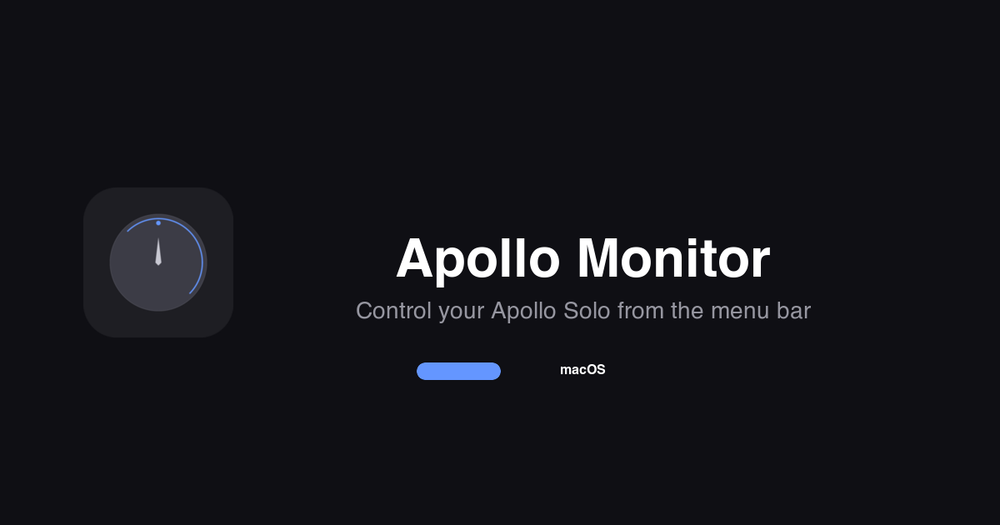

<p align="center">
  
</p>

<p align="center">
  <a href="https://github.com/noiseheroes/ApolloMonitor/releases"></a>
  
  
  <a href="LICENSE"></a>
  
</p>

---

## Overview

Apollo Monitor is a lightweight menu bar utility that gives you instant access to your Universal Audio Apollo Solo's monitor controls without needing to open the full UA Console application.

Perfect for producers, engineers, and musicians who want quick access to essential monitoring functions while working in their DAW.

## Features

| Feature | Description |
|---------|-------------|
| **Volume Control** | Precise dB control with visual slider (-∞ to 0 dB) |
| **Mute** | One-click mute toggle with visual feedback |
| **Dim** | -17dB dim function for quick level reduction |
| **Mono** | Mono summing for checking mix translation |
| **Real-time Sync** | Bi-directional sync with UA Console app |
| **Native UI** | Built with SwiftUI, follows Apple Human Interface Guidelines |
| **Lightweight** | Runs silently in menu bar, minimal resource usage |

## Requirements

- **macOS 13.0** (Ventura) or later
- **Universal Audio Apollo Solo** (Thunderbolt)
- **UA Console** app must be running

## Installation

### Option 1: Download Release

1. Download the latest `.dmg` from [Releases](https://github.com/noiseheroes/ApolloMonitor/releases)
2. Open the DMG and drag `Apollo Monitor.app` to your **Applications** folder
3. Launch the app — it will appear in your menu bar with a dial icon

### Option 2: Build from Source

```bash
# Clone the repository
git clone https://github.com/noiseheroes/ApolloMonitor.git
cd ApolloMonitor

# Open in Xcode
open ApolloMonitor.xcodeproj
```

Then in Xcode:
1. Select your **Development Team** in Signing & Capabilities
2. Build and Run (⌘R)

## Usage

1. **Click the dial icon** in your menu bar to open the control panel
2. **Drag the slider** to adjust monitor volume (-∞ to 0 dB)
3. **Click the buttons** to toggle Mute, Dim, or Mono
4. The panel **automatically closes** when you click outside

### Controls

| Control | Function | Visual Indicator |
|---------|----------|------------------|
| Volume Slider | Adjusts monitor output level | Blue slider + dB display |
| Mute | Silences monitor output | Red highlight when active |
| Dim | Reduces level by 17dB | Orange highlight when active |
| Mono | Sums stereo to mono | Purple highlight when active |

## How It Works

Apollo Monitor communicates with the UA Console application via a **local TCP socket** on port `4710`. This is the same internal protocol used by Universal Audio's own software.

### Technical Details

```
Protocol: TCP/IP
Port: 4710
Host: 127.0.0.1 (localhost)
Format: JSON over null-terminated strings
```

### Supported Commands

| Parameter | Path | Type |
|-----------|------|------|
| Monitor Level | `/devices/0/outputs/4/CRMonitorLevel` | Float (dB) |
| Mute | `/devices/0/outputs/4/Mute` | Boolean |
| Dim | `/devices/0/outputs/4/DimOn` | Boolean |
| Mono | `/devices/0/outputs/4/MixToMono` | Boolean |

## Project Structure

```
ApolloMonitor/
├── ApolloMonitor/              # Main menu bar app
│   ├── ApolloMonitorApp.swift  # App entry point
│   ├── AppDelegate.swift       # Menu bar setup & lifecycle
│   ├── MonitorView.swift       # SwiftUI interface
│   └── Info.plist              # App configuration
│
├── ApolloMonitorWidget/        # macOS Widget (WidgetKit)
│   └── ApolloMonitorWidget.swift
│
├── Shared/                     # Shared code between targets
│   ├── ApolloController.swift  # State management (ObservableObject)
│   └── ApolloTCP.swift         # TCP client for UA Console
│
├── Assets.xcassets/            # App icon and assets
├── project.yml                 # XcodeGen configuration
└── README.md
```

## Troubleshooting

### App shows "Connecting..." but never connects

- Make sure **UA Console** is running
- Check that your Apollo Solo is connected and powered on
- Try clicking the **refresh button** in the app footer

### Volume changes don't sync with UA Console

- Ensure you're controlling the correct output (Monitor output 4)
- Restart both Apollo Monitor and UA Console

### App doesn't appear in menu bar

- Check System Settings → Control Center → Menu Bar Only
- Try quitting and relaunching the app

## Credits

### Protocol Discovery

The TCP protocol for communicating with Universal Audio devices was discovered and documented by the **[cuefinger](https://github.com/tschiemer/cuefinger)** project by [@tschiemer](https://github.com/tschiemer).

This project would not be possible without their excellent reverse engineering work on the UA Console protocol.

### Development

- Created by [Noise Heroes](https://github.com/noiseheroes)
- Built with assistance from [Claude](https://claude.ai) by Anthropic

## License

This project is licensed under the **MIT License** — see the [LICENSE](LICENSE) file for details.

## Disclaimer

This is an **unofficial third-party application**.

Universal Audio, Apollo, Apollo Solo, and UA Console are trademarks of Universal Audio, Inc. This project is not affiliated with, endorsed by, or sponsored by Universal Audio.

---

<p align="center">
  Made with ♥ for the audio community
</p>
